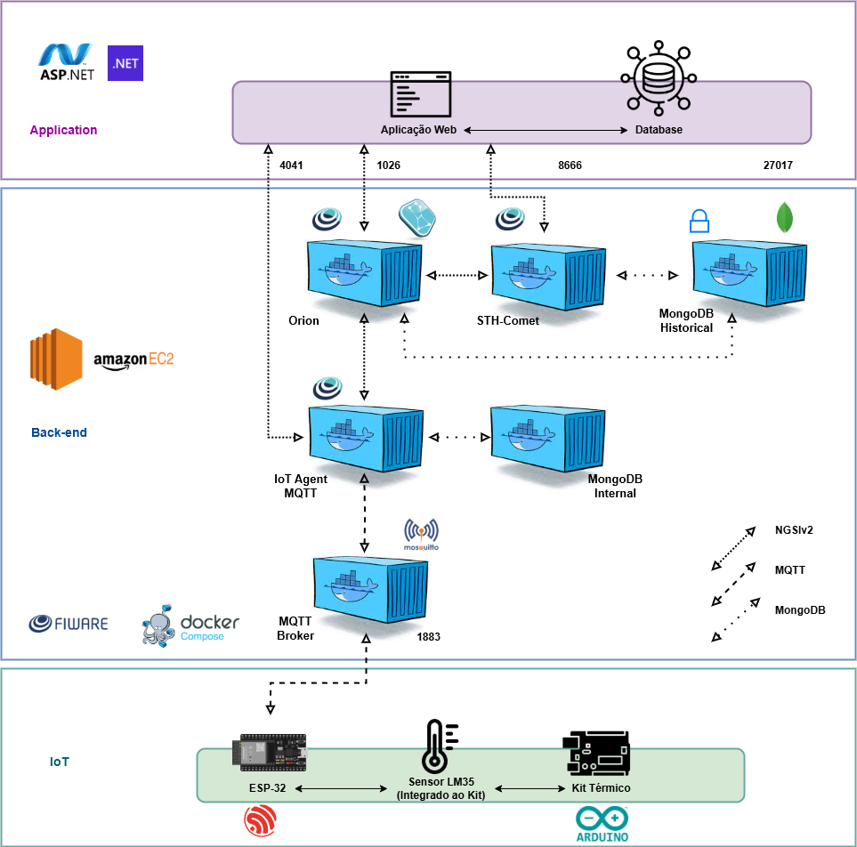

# 🌡️ Sistema de Monitoramento IoT para Controle Térmico de Estufas de Secagem de Motores Elétricos

  
  
  

## 📌 Descrição do Projeto

Este projeto tem como objetivo o desenvolvimento de um sistema de **monitoramento inteligente**, baseado em **Internet das Coisas (IoT)**, para o **controle térmico de estufas** utilizadas na secagem de motores elétricos.

### 🎯 Objetivos principais:

- 📡 Coletar **dados de temperatura em tempo real** de forma precisa e eficiente;
- 🌐 Utilizar a **plataforma FIWARE** como back-end para gerenciamento de contexto;
- 💻 Implementar um sistema web em **ASP.NET Core MVC** para exibição de dashboards e controle dos dados;
- 🔍 Garantir a **uniformidade do processo de secagem**, promovendo eficiência operacional;
- 🧩 Oferecer funcionalidades como **cadastro, consulta e visualização gráfica** dos dados coletados pelos sensores IoT.

---
## 📷 Funcionalidades Implementadas

- ✅ **Leitura de temperatura** em tempo real via sensores conectados a dispositivos IoT;
- ✅ **Envio dos dados** para o contexto FIWARE;
- ✅ **Interface Web** para visualização dos dados em tempo real;
- ✅ **Painel administrativo** com cadastro de sensores e estufas;
- ✅ **Gráficos e dashboards interativos**;
- ✅ **Acesso remoto** via navegador, permitindo o controle de qualquer lugar.

---

## 🌐 Arquitetura do Sistema

```mermaid
graph LR
A[Sensores IoT] --> B[Broker Orion - FIWARE]
B --> C[Backend ASP.NET Core]
C --> D[Frontend MVC]
D --> E[Usuário/Admin]
```

---

## 🗂️ Diagrama do Sistema

  

---

## 🧠 Aprendizados e Desafios

Durante o desenvolvimento deste projeto, exploramos na prática:

- Integração de sensores com protocolos IoT;
- Comunicação com o **FIWARE** para manipulação de entidades contextuais;
- Construção de **dashboards web com ASP.NET Core MVC**;
- Aplicação de conceitos de **engenharia de software, arquitetura de sistemas e UX/UI**.
